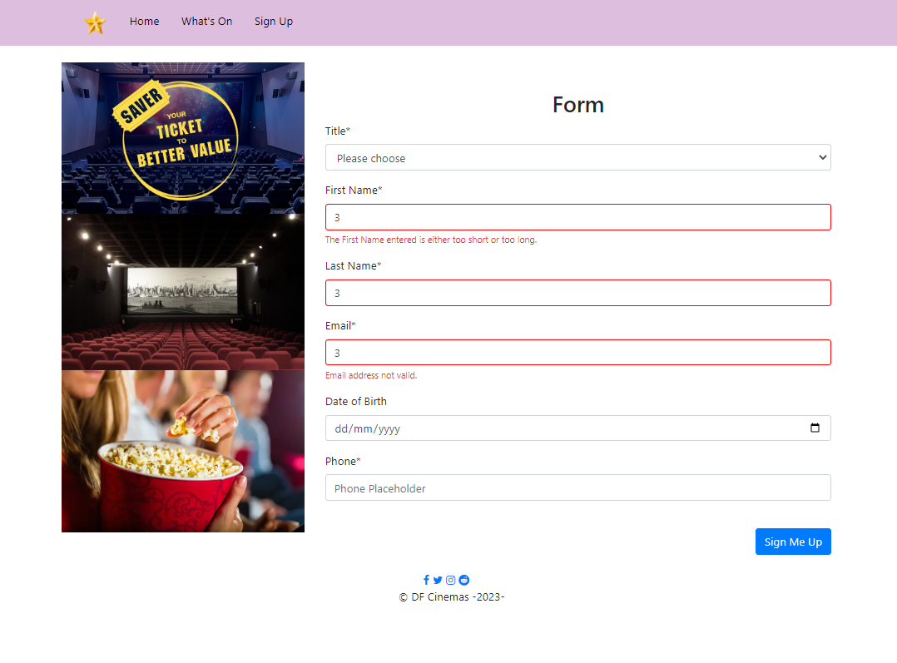

# DF Cinemas Hackathon
Hackathon Part 1 - HTML & CSS

Hackathon Part 2 - JavaScript

## Overview
DF Cinemas has approached us to create a modern looking website promoting their cinemas. In the first iteration, they would like to be able to provide their customers with general information about their cinemas, schedule and opening hours and allow them to subscribe to receive some promotional materials.

The business representatives have worked with our UI/UX team and they have created the following low fidelity mock-ups. They understand that their customers view their pages on different devices and want us to accommodate to this. The site will be split into three pages –

- home page with information about the Cinemas;

- a 'schedule' page displaying opening hours and movies showing this week;

- a 'signup' page to gather some information about the user.

The navigation between the pages should be easy and straightforward, with a navigation bar on top of each page.


## User Stories
The User Stories have been prioritised and ordered:
```
As a User, I want to be presented with a home page, so that I can see some general information and pictures showing DF Cinemas.
As a User, I want to be able to see the opening hours of the cinema, so that I know when the cinema is open.
As a User, I want to be able to see the movie schedule for this week, so that I know what is on and at what time.
As a User, I want to be able to subscribe to the website using a form, so that I can receive the latest promotions and information.
As a User, I want to be able to access the website on any device, so that I can access the information I need on the device of my choice.
As a User, I want to be able to see an immediate validation of my input into the sign-up form, so that I know if the information I enter will be acceptable.
```





## Acknowledgement 

[How to get value from onchange?](https://stackoverflow.com/questions/33812497/how-to-get-value-from-onchange)

[JavaScript: How to Hide / Unhide <div>](https://stackoverflow.com/questions/14092940/javascript-how-to-hide-unhide-div)

[jQuery document ready](http://learn.jquery.com/using-jquery-core/document-ready/)